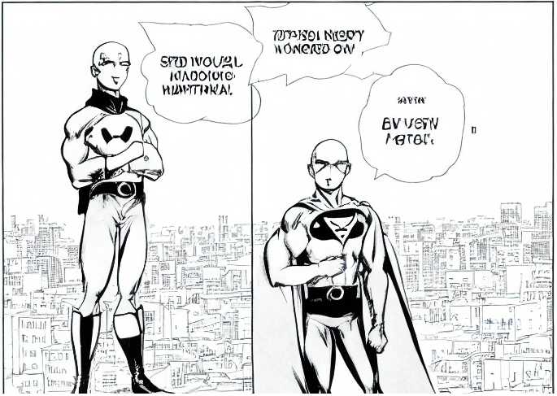

# Stable Diffusion - Image Generation for Artists



This project aims to implement Stable Diffusion for image generation, in order to assist artists in iterating upon concepts more quickly.

This project was built leveraging the Huggingface Diffusers library, which provides a flexible and easy-to-use implementation of stable diffusion. This allowed us to quickly and efficiently implement the algorithm, and focus on developing features and improvements specifically tailored to the needs of artists.

This readme was partially generated using [chatGPT](chat.openai.com/chat). You have no excuse to provide code without documentation! The future is now.

## Requirements
In order to run this project, you will need:

- Python 3.6 or later
- torch
- numpy
- diffusers
- accelerate (recommended)
- nvidia-docker2 (if using docker)
- git-lfs (if not using docker)

## Installation

To install the project, clone this repository and install the required packages:

```
$ git clone https://github.com/ambisinister/stable-diffusion-for-comics.git
$ cd stable-diffusion-for-comics
$ pip install -r requirements.txt
```

To build a docker image or to run locally, [accept the stable diffusion license agreement](https://huggingface.co/runwayml/stable-diffusion-v1-5) and then run the following commands

```
git lfs install
git clone https://huggingface.co/runwayml/stable-diffusion-v1-5
```

## Usage

To use stable diffusion, simply run the following command:

```
$ python diffusion.py --prompt "Godzilla eating a meatball sub"
```

This will generate a new image based on the text prompt, and save it to a file called "output.png". You can change the --saveas argument.

To perform **img2img generation**, run the following command

```
$ python diffusion.py --prompt "Godzilla eating a meatball sub" --img /path/to/input_image.png
```

This will generate a new image based on the text prompt, starting from a source image instead of a random noise image.

## Docker Usage
This project includes a Dockerfile which can be used to build a Docker image containing all of the required dependencies. To build the Docker image, run the following from the root of the project directory:

```
cd docker
docker build -t stable-diffusion .
cd ../
```

This will create a Docker image with the tag "stable-diffusion". **Note that this image differs from the one on docker hub, which contains the model, and is much heavier, compared to this one, which mounts a folder**

You can then run the image as a container with the following command:

```
docker run --gpus all -it -v $(pwd):/app --rm --network=host -p 8888:8888 stable-diffusion
```

or, alternatively, with the provided script

```
sh ./scripts/run_docker.sh
```

This will start a new container based on the "stable-diffusion" image, and place you in an interactive terminal. From there, you can run the notebook via jupyter lab, or you can run the script via diffusion.py

If you are not interested in the interactive shell, you can pass any command line arguments to the script by appending them to the docker run command. For example, to run the algorithm on a specific input image and save the output to a specific path, you can use the following command:

```
docker run --gpus all -v $(pwd):/app --rm stable-diffusion python diffusion.py --prompt "A superhero flying over the city" --img path/to/input_image.png --saveas path/to/output_image.png
```

or, alternatively, with the provided script, which you will need to edit with paths to your files

```
sh ./scripts/diffuse.sh
```

Note that the input_image and output_image paths should be specified with respect to the root of the project directory inside of the container.

## Contribution
If you would like to contribute to this project, please fork this repository and make any desired changes. Then, submit a pull request for review.

## License
This project is licensed under the MIT License. See the LICENSE file for more details.
